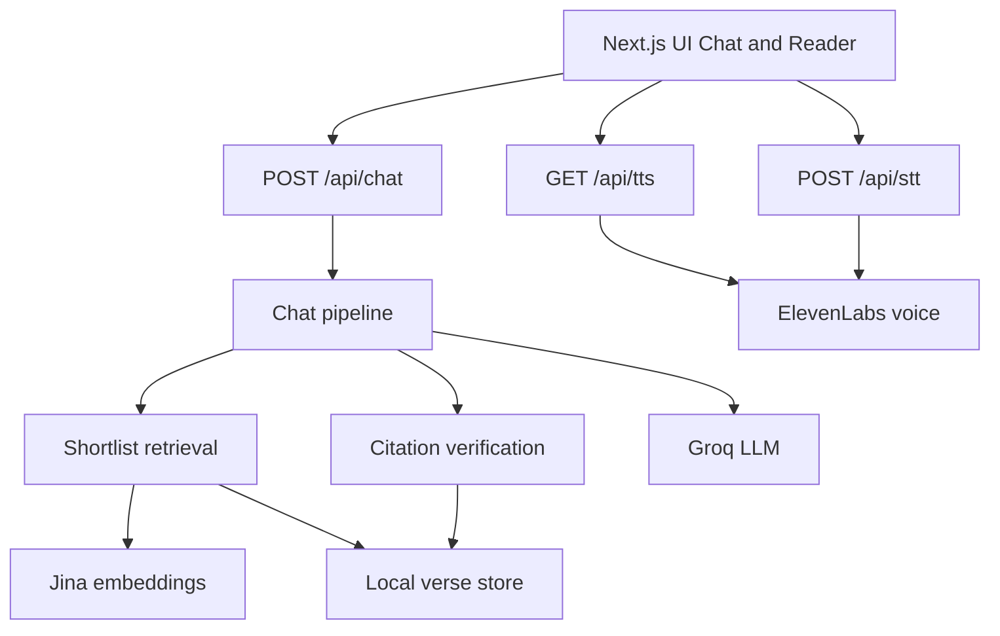

# Speak with Krishna — Architecture Overview

**Audience:** Tech Lead / engineering review  
**Product:** A Bhagavad Gita chat and reading app. The user describes a personal situation and receives guidance in Krishna’s voice, grounded only in real Gita verses. Sanskrit on screen is never invented by the model.

---

## 1. What the product does

| Area | What the user gets |
| --- | --- |
| Chat (`/`) | Describe a worry or question → short guidance + cited verse cards |
| Reader (`/gita`, `/gita/[chapter]`) | Browse all 18 chapters and 701 verses |
| Voice | Optional speak / listen (browser fallback, or ElevenLabs when configured) |
| Daily verse | One verse of the day on the home screen |

**Core accuracy rule:** The LLM writes the guidance. The **server** decides which verse text appears. Verse text is copied from local files, not from the model output.

---

## 2. High-level architecture



**One app, no separate backend.** Next.js App Router hosts both the UI and the API routes.

---

## 3. Chat request flow (accuracy path)

When the user sends a message:

1. **Understand** — Groq extracts intent, language, emotions, and themes (JSON).
2. **Search** — Build a short list of candidate verses (~18), using:
   - Precomputed verse embeddings (Jina)
   - Theme / keyword overlap
   - Enrichment metadata (`verse-enriched.json`)
3. **Choose** — Groq picks citations **only from that shortlist**.
4. **Verify** — Server checks every citation against the local corpus. Invalid IDs are dropped; one retry is allowed.
5. **Write** — Groq writes guidance in the user’s language. Guidance must not contain Sanskrit or verse numbers.
6. **Attach** — Server attaches Sanskrit, transliteration, word meanings, and translations from files.
7. **Stream** — Optional NDJSON stream so the UI can show progress and verified sentences as they arrive.

If no verse fits confidently, the app answers without citing one.

---

## 4. Technology stack (what / why)

| Technology | Role |
| --- | --- |
| **Next.js 15** (App Router) | Web UI + API in one deployable app |
| **React 19** | Chat screen, reader pages, client interactions |
| **TypeScript** | Typed corpus, pipeline, and API contracts |
| **Node.js runtime** | API routes that read local JSON/CSV and call external APIs |
| **Groq** (`openai` SDK → `https://api.groq.com/openai/v1`) | Fast chat LLM for situation, selection, and reply JSON |
| **Jina embeddings** | Semantic search over verses (query vs precomputed vectors) |
| **ElevenLabs** | Optional TTS (Krishna voice) and STT (voice input) |
| **Local JSON / CSV** | Source of truth for scripture (no DB in this phase) |
| **tsx + Node test runner** | Unit tests and offline scripts (`enrich`, `embed`, `eval`) |

### Not used (on purpose)

| Item | Reason |
| --- | --- |
| Postgres / pgvector | Deferred; corpus is file-based for now |
| Full-corpus prompt every request | Too large for Groq free/on-demand TPM limits |
| Model-generated Sanskrit | Accuracy risk; server always copies stored text |

---

## 5. Data sources (local)

| File | Purpose |
| --- | --- |
| `verse.json` | Immutable Sanskrit + transliteration + word meanings (701 verses) |
| `Bhagwad_Gita.csv` | English and Hindi prose meanings |
| `verse-enriched.json` | Per-verse themes, short summary, situations, “not for” notes |
| `verse-embeddings.json` | Precomputed Jina vectors for retrieval |

Offline scripts:

- `npm run enrich` — build / refresh `verse-enriched.json`
- `npm run embed` — build / refresh `verse-embeddings.json`
- `npm run eval` — run a golden situation set for citation quality

---

## 6. Main modules

| Path | Responsibility |
| --- | --- |
| `src/app/chat-screen.tsx` | Chat UI |
| `src/app/gita/*` | Chapter / verse reader |
| `src/app/api/chat/route.ts` | Chat HTTP API (JSON or stream) |
| `src/app/api/tts/route.ts` | Text → speech |
| `src/app/api/stt/route.ts` | Speech → text |
| `src/lib/pipeline.ts` | End-to-end chat orchestration |
| `src/lib/llm.ts` | Groq client (situation / select / write / converse) |
| `src/lib/retrieve.ts` | Shortlist from embeddings + themes |
| `src/lib/verify.ts` | Parse model JSON; validate citations; leak checks |
| `src/lib/corpus.ts` | Load and quarantine verse fields |
| `src/lib/embed.ts` | Jina embed + load verse vectors |
| `src/lib/safety.ts` | Crisis wording + helpline block |
| `src/lib/session.ts` | In-memory chat history (cleared on restart) |
| `src/lib/rate-limit.ts` | Simple request limiting |
| `src/lib/speech.ts` / `elevenlabs.ts` | Speakable text + voice providers |

---

## 7. API surface

| Endpoint | Method | Purpose |
| --- | --- | --- |
| `/api/chat` | POST | Chat: `{ sessionId, message }` or `{ sessionId, reset: true }`; optional `stream: true` |
| `/api/tts` | GET | Speak a previous assistant reply |
| `/api/stt` | POST | Transcribe microphone audio |

Chat body limits: message max **2000** characters; session kept in memory (about last **8** turns).

---

## 8. Accuracy and safety controls

- **Citation allow-list:** model may only cite shortlisted refs; server re-checks against corpus.
- **Scripture copy:** Sanskrit / Latin fields come from `verse.json` (+ CSV / enrichment for display prose).
- **Quarantine:** known bad Latin fields on a few verses are withheld from prompt and UI.
- **Guidance leak check:** verse numbers or Devanagari inside guidance trigger retry / fixed lead-in.
- **Crisis path:** self-harm language surfaces a fixed safety message and helplines (does not invent clinical advice).
- **Secrets:** keys live in `.env.local` only; error logs redact API key patterns.

---

## 9. Environment (names only)

Configure in `.env.local` (never commit):

| Variable | Used for |
| --- | --- |
| `GROQ_API_KEY` / `GROQ_MODEL` | Chat LLM |
| `JINA_API_KEY` / `JINA_EMBED_MODEL` | Embeddings |
| `ELEVENLABS_API_KEY` / `ELEVENLABS_VOICE_ID` / TTS & STT model vars | Voice (optional) |

---

## 10. How to run

```bash
npm install
npm run dev          # local app
npm test             # unit tests
npm run enrich       # optional: refresh verse enrichment
npm run embed        # optional: refresh embeddings
npm run eval         # optional: citation eval set
```

---

## 11. Current phase vs later work

| Status | Scope |
| --- | --- |
| **In place** | English (and multi-language replies), shortlist + embedding retrieval, citation verification, reader, streaming, optional voice, daily verse, crisis safety |
| **Later (typical)** | Durable Postgres sessions, stronger rate limits / ops logging, broader eval set, production hosting hardening |

---

## 12. One-line summary for TL

**Next.js monolapp that uses Groq for language, Jina for verse search, and local Gita files as the only scripture source of truth, with server-side citation verification so the UI never shows invented verses.**
